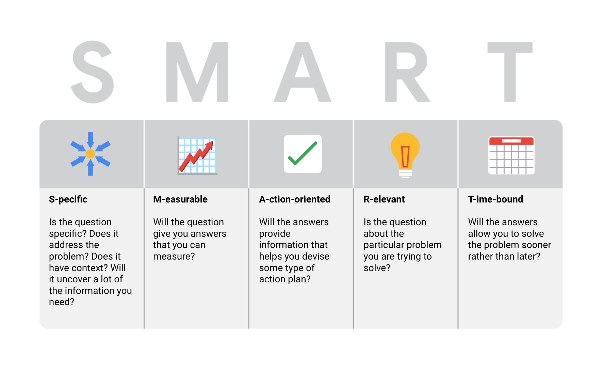

# <a name="top">Google Data Analytics</a>

# Tables of Contents:
* [Foundations: Data, Data, Everywhere](#foundations)
* [Ask Questions to Make Data-Driven Decisions](#decisions)
* [Prepare Data for Exploration](#exploration)
* [Process Data from Dirty to Clean](#clean)
* [Analyze Data to Answer Questions](#analyze)
* [Share Data Through the Art of Visualization](#visual)
* [Data Analysis with R Programming](#r)
* [Google Data Analytics Capstone: Complete a Case Study](#capstone)
______________________________________________

# <a name="foundations">Foundations: Data, Data, Everywhere</a>


Creating a framework to work with as a data analyst. The exacts steps in the process may change, but the flow of asking a questing, obtaining, cleaning, and analyzing data, and interpreting results remains constant.

Planning a project involves; deciding what questions to ask and what type of data that requires; how collecting the data would ideally look and how to manage it once gathered; what type of analysis will be done and what that requires; what to do with the results and data once the project is completed.

1​. Data life cycle:
- Plan
- Capture
- Manage
- Analyze
- Archive
- Destroy

2​. Data analysis process:
- Ask
- Prepare
- Process
- Analyze
- Share
- Act

A problem is an obstacle to be solved, an issue is a topic to investigate, and a question is designed to discover information.


______________________________________________

# <a name="decisions">Ask Questions to make Data-Driven Decisions</a>
## The Six Steps of Data Analysis 
### Step 1: Ask
It’s impossible to solve a problem if you don’t know what it is.
- Define the problem you’re trying to solve 
- Make sure you fully understand the stakeholder’s expectations
- Focus on the actual problem and avoid any distractions
- Collaborate with stakeholders and keep an open line of communication
- Take a step back and see the whole situation in context
Questions to ask yourself in this step: 
1. What are my stakeholders saying their problems are?
2. Now that I’ve identified the issues, how can I help the stakeholders resolve their questions?

### Step 2: Prepare 
You will decide what data you need to collect in order to answer your questions and how to organize it so that it is useful. You might use your business task to decide: 

- What metrics to measure
- Locate data in your database
- Create security measures to protect that data
Questions to ask yourself in this step: 
1. What do I need to figure out how to solve this problem?
2. What research do I need to do?

### Step 3: Process
Clean data is the best data and you will need to clean up your data to get rid of any possible errors, inaccuracies, or inconsistencies. This might mean:

- Using spreadsheet functions to find incorrectly entered data 
- Using SQL functions to check for extra spaces
- Removing repeated entries
- Checking as much possible for bias in the data
Questions to ask yourself in this step: 
1. What data errors or inaccuracies might get in my way of getting the best possible answer to the problem I am trying to solve?
2. How can I clean my data so the information I have is more consistent?

### Step 4: Analyze 
You will want to think analytically about your data. At this stage, you might sort and format your data to make it easier to: 

- Perform calculations
- Combine data from multiple sources
- Create tables with your results
Questions to ask yourself in this step:
1. What story is my data telling me?
2. How will my data help me solve this problem?
3. Who needs my company’s product or service? What type of person is most likely to use it?

### Step 5: Share
Everyone shares their results differently so be sure to summarize your results with clear and enticing visuals of your analysis using data viz tools like graphs or dashboards. This is your chance to show the stakeholders you have solved their problem and how you got there. Sharing will certainly help your team:  

- Make better decisions
- Make more informed decisions
- Lead to stronger outcomes
- Successfully communicate your findings
Questions to ask yourself in this step:
1. How can I make what I present to the stakeholders engaging and easy to understand?
2. What would help me understand this if I were the listener?

### Step 6: Act
Now it’s time to act on your data. You will take everything you have learned from your data analysis and put it to use. This could mean providing your stakeholders with recommendations based on your findings so they can make data-driven decisions.

Questions to ask yourself in this step:
1. How can I use the feedback I received during the share phase (step 5) to actually meet the stakeholder’s needs and expectations?

These six steps can help you to break the data analysis process into smaller, manageable parts, which is called structured thinking. This process involves four basic activities:

1. Recognizing the current problem or situation
2. Organizing available information 
3. Revealing gaps and opportunities
4. Identifying your options

#### Data analysts typically work with six problem types


## S.M.A.R.T Questions

What features do people look for when buying a new car?
- Specific: Does the question focus on a particular car feature?
- Measurable: Does the question include a feature rating system?
- Action-oriented: Does the question influence creation of different or new feature packages?
- Relevant: Does the question identify which features make or break a potential car purchase?
- Time-bound: Does the question validate data on the most popular features from the last three years? 

______________________________________________
### Glossary

Action-oriented question
: A question whose answers lead to change

Analytical skills
: Qualities and characteristics associated with using facts to solve problems

Analytical thinking
: The process of identifying and defining a problem, then solving it by using data in an organized, step-by-step manner

Attribute
: A characteristic or quality of data used to label a column in a table

Business task
: The question or problem data analysis answers for a business

Context
: The condition in which something exists or happens

Data
: A collection of facts.

Data analysis
: The collection, transformation, and organization of data in order to draw a conclusion, make predictions, and drive informed decision-making

Data analyst
: Someone who collects, transforms, and organizes data in order to drive informed decision-making

Data analytics
: The science of data

Data design
: How information is organized

Data-driven decision-making
: The process of using facts to guide business strategy

Data ecosystem
: The various elements that interact with one another in order to produce, manage, store, organize, analyze, and share data

Data science
: A field of study that uses raw data to create new ways of modeling and understanding the unknown

Data strategy
: The management of the people, process, and tools used in data analysis

Data visualization
: The graphical representation of data

Database
: A collection of data stored in a computer system

Dataset
: A collection of data that can be manipulated or analyzed as one unit

Fairness
: A quality of data analysis that does not create or reinforce bias

Formula
: A set of instructions used to perform a calculation using the data in a spreadsheet

Function
: A preset command that automatically performs a process of task using the data in a spreadsheet

Gap analysis
: A method for examining and evaluating the current state of a process in order to identify opportunities for improvement in the future

Observation
: The attribute that describes a piece of data contained in a row of a table

Query
: A request for data or information from a database

Query language
: A computer programming language used to communicate with databases

Root cause
: The reason why a problem occurs

Stakeholders
: People who invest time and resources into a project and are interested in its outcome

Technical mindset
: The ability to break things down into smaller steps or pieces and work with them in an orderly and logical way
[Back to top](#top)
______________________________________________

# <a name="decisions">Ask Questions to make Data-Driven Decisions</a>


______________________________________________
# <a name="blank">blank</a>

First Term
: This is the definition of the first term.[^footnote]

[^footnote]: this is the footnote

- [ ] Bullet list

```python

```
[Back to top](#top)
______________________________________________

